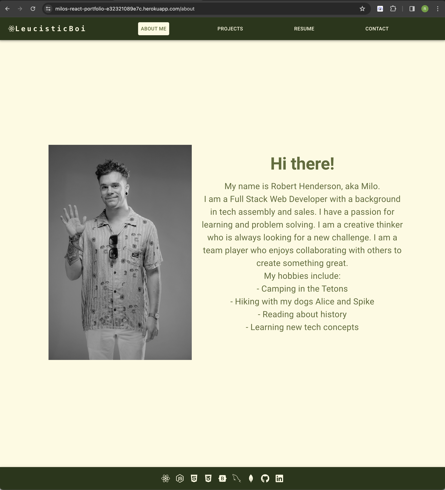

# LeucisticBoi's React-Based Portfolio

## Directory

[Overview](#Overview)

[License](#license)

[Deployed URL](#deployed-url)

[References](#references)

## Overview

This is a React.js-based portfolio site to showcase my interests, skills, and current/past web-development projects. There is also a 'Contact Me' page that allows you to email inquiries directly from the site.

The website header contains links to each local page on the portfolio site. The footer contains icon links to documentation for each language and skill that I have developed thus far. The header `React` icon and username `LeucisticBoi` also function as home buttons.

The header will automatically highlight the name of whatever page you are currently viewing. 

## License

[MIT](https://choosealicense.com/licenses/mit/)

A short and simple permissive license with conditions only requiring preservation of copyright and license notices. Licensed works, modifications, and larger works may be distributed under different terms and without source code.

## Deployed URL
[LeucisticBoi's Portfolio](https://milos-react-portfolio-e32321089e7c.herokuapp.com/)

# Screenshot

## References

GitHub Copilot was useful in debugging my Heroku deployment issues. Heroku is always tricky but I'm starting to get the hang of it :)

[Brian Whisler](https://brian-whisler.netlify.app/) recommended MUI for CSS, and provided useful links to MUI documentation. The [MUI documentation](https://mui.com/material-ui/getting-started/) was very useful for learning everything, from simple component structure to defining my own global theme.

I used [this YouTube video](https://www.youtube.com/watch?v=bMq2riFCF90) to make my contact form functional.

For my resume page, I originally found [this](https://stackoverflow.com/questions/42042901/setting-iframe-height-to-scrollheight-in-reactjs) Stack Overflow page led me to [this](https://www.npmjs.com/package/iframe-resizer-react) NPM package documentation. Mobile view was more complex than I liked, so I converted my resume pdf into two png files.

## Questions

For any questions:

[My Github Profile](https://github.com/LeucisticBoi)

`Email: robert.henderson0597@gmail.com`